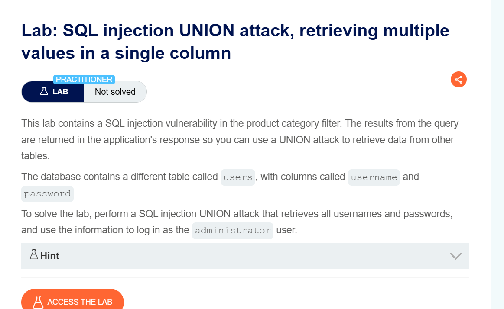
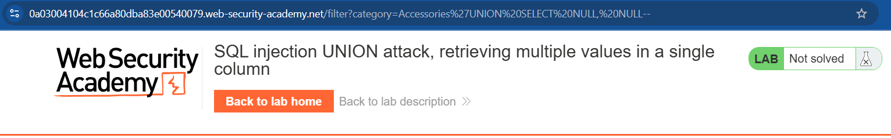
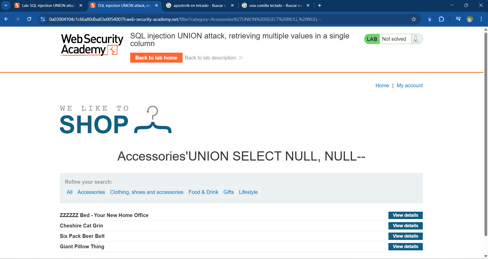
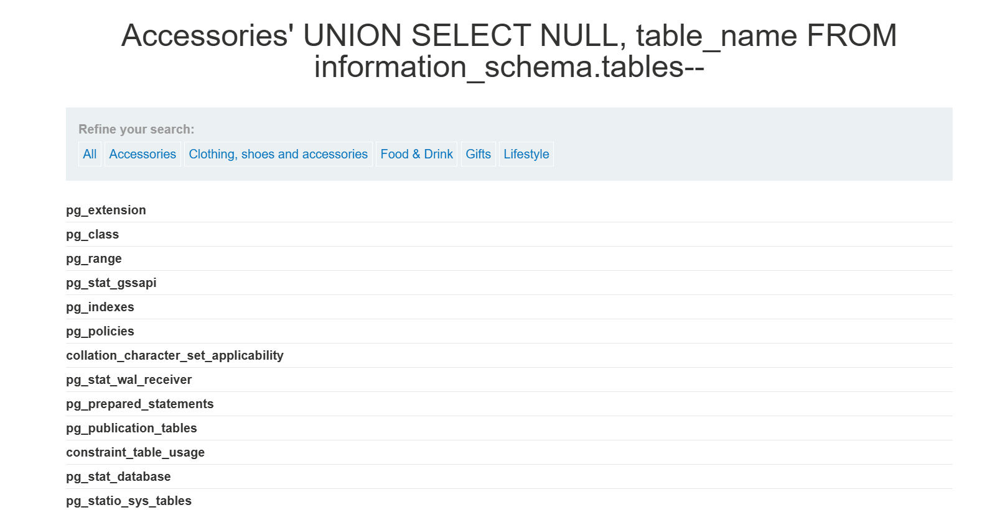
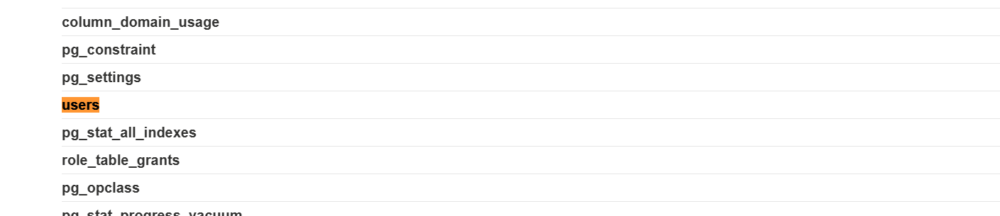
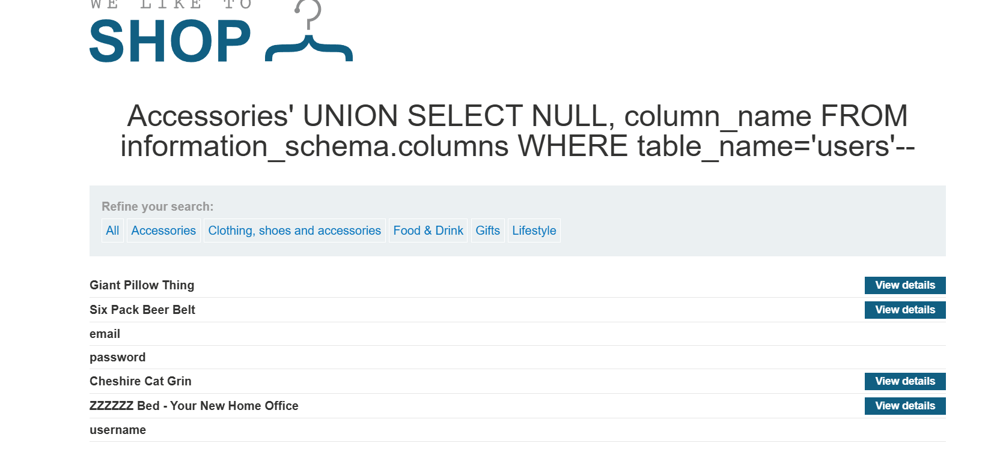
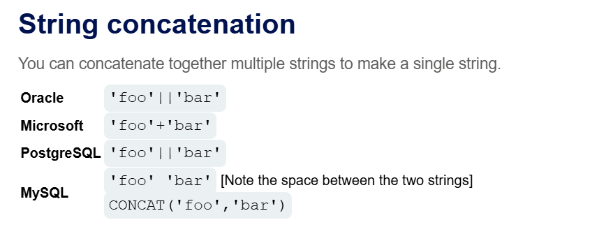
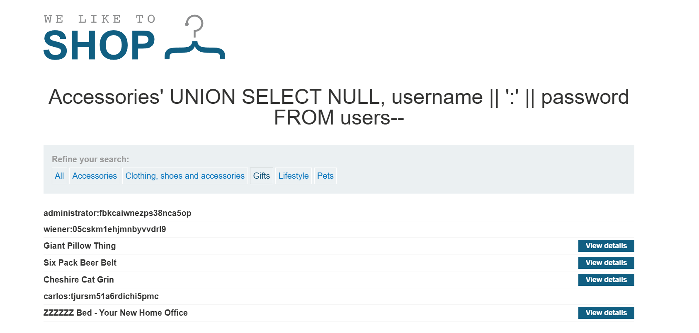
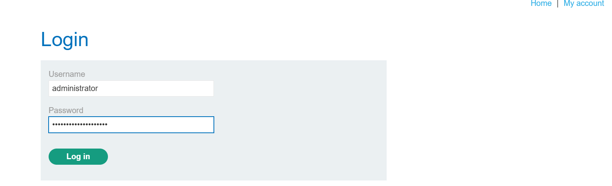
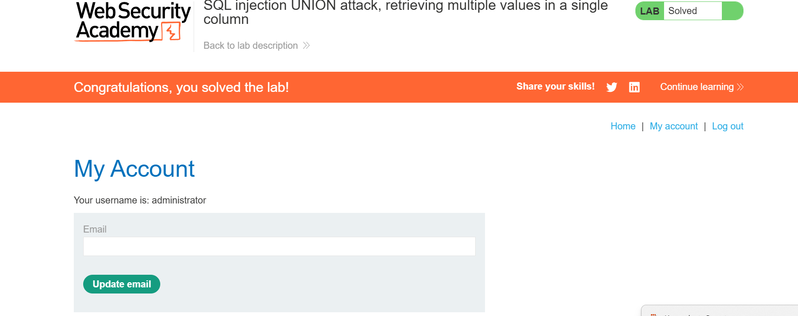

# Laboratorio 10: SQL Injection UNION Attack, Retrieving Multiple Values in a Single Column 
## Objetivo  
Mostrar usuario y contraseña en una tabla e iniciar sesión como **ADMINISTRATOR**  

---

## Análisis de la Base de Datos  

En primer lugar identificamos o nos guiamos de una sentencia base la cual después de la estructura de category en nuestro caso "Accesorios", realizamos una busqueda de tipo 'UNION SELECT: con el fin de encontrar en que columna se encuentra alojado las tablas.

'UNION SELECT NULL-- primera columna (-- para terminar la sentencia)

'UNION SELECT NULL, NULL-- segunda columna, obtenemos un resultado con el cual concluimos que en la posición 2 se encuentran alojadas las tablas como se observa en la imagen.

El segundo campo de la base de datos es el campo de la columna que almacena los títulos.  

Se realiza la siguiente búsqueda partiendo de lo descubierto: el **campo dos** es donde se debe inyectar información. En este caso, para localizar el **nombre de la tabla** que se desea atacar.  

'UNION SELECT NULL, table_name FROM information_schema.tables--

Se encuentra la tabla `users`, y se comprueba que es la misma que se nos facilita en las indicaciones del laboratorio a resolver. 

## Obtención de Datos  

A continuación, se ejecuta una búsqueda para listar todos los campos dentro de la tabla `users`.  

'UNION SELECT NULL, column_name FROM information_schema.column WHERE table_name= 'users'--

Por último realizamos una consulta modificada siguiendo la **SQL Injection Cheat Sheet**, considerando que se trabaja en **PostgreSQL**:  

La sentencia módificada para la búsqueda es la siguiente:

*PostgreSQL* 'foo'||'bar' quedando como resultado final de la inyección la siguiente: 

'UNION SELECT NULL, username || ':' || password FROM users--

Una vez realizado la consulta obtenemos lo que nos solicitan en el laboratorio y lo concluimos con éxito.

User: administrator
Pass: fbkcaiwnezps38nca5op

